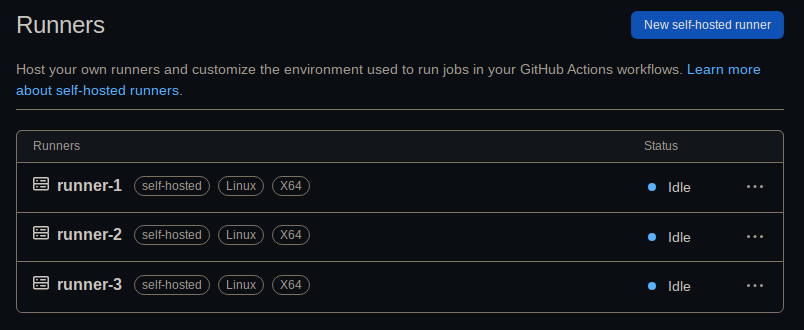

# GitHub Self-Hosted Runner Docker

Docker image that can be used for self-hosting [GitHub Actions Runner](https://github.com/actions/runner).

## Development

Set desired upstream version/tag in [`version`](./version) file. See the list of releases [here](https://github.com/actions/runner).

## Features

- Fully isolated environment for job execution. There's no need to any post-run cleanups.
- Based on Ubuntu Docker image with the latest Docker version installed
- Provides some applications pre-installed. See the list of packages installed in addition to what the base image provides in the [Dockerfile](./Dockerfile).

## Architecture

The deployment model that I had in mind that this Docker image plays well within is something like below:

1. Docker containers are created, or replaced with existing ones, and managed by Docker Compose
2. A job that is assigned to a runner by GitHub will be executed by a runner, e.g., `Runner #3`
3. Once the runner has finished a job that was assigned to it, either with success, or failure result, it will be both unregistered from GitHub, and its container will be removed
4. As Docker Compose is configured to keep the specified number of container instances up and running (using `restart: always` option), it will recreate the container that was just removed
5. The newly (re)created container will register itself to GitHub, and it'll be listening for new jobs

## Usage

The following environment variables needs to be provided to the container:

- `ACCESS_TOKEN`

   A token that is used for creating runner registration token. See [the documentation](https://docs.github.com/en/rest/actions/self-hosted-runners?apiVersion=2022-11-28#create-a-registration-token-for-a-repository) for more details, such as necessary token permission scopes. Currently, I'm using a token with `repo` permission scope.

- `REPO`

   Name of the repository you want to create, and assign runner for in `username/repo` format, e.g., `xeptore/runner`.

Regarding the deployment, I personally use Docker Compose, which handles restarts, and crashes, inside a VM, e.g., using [Vagrant](https://vagrantup.com/). The following is a basic template for a runner deployment with 3 instances:

```yml
name: actions-runner
services:
  runner-1: &service
    hostname: runner-1
    container_name: actions-runner-1
    image: ghcr.io/xeptore/runner:latest
    restart: always
    privileged: true
    stop_grace_period: 5s
    stop_signal: SIGINT
    init: true
    environment:
      REPO: ${REPO}
      ACCESS_TOKEN: ${ACCESS_TOKEN}
  runner-2:
    <<: *service
    hostname: runner-2
    container_name: actions-runner-2
  runner-3:
    <<: *service
    hostname: runner-3
    container_name: actions-runner-3
```

Which upon successful runners registration, results in something similar to this in the repository's runners settings (accessible via <https://github.com/REPO/settings/actions/runners>):



**Note:** As you can see, name of each runner is set to its respective `hostname` in the compose configuration.

## Next Steps

- [ ] Try [sysbox](https://github.com/nestybox/sysbox) under a reasonably complex workflow job execution hoping to get rid of privileged container run.
- [ ] Simplify scale up & down. Maybe a simple helper script over Docker Compose command line, or something that generates a Compose-compliant spec file, and pipes it into Docker Compose would suffice.
- [ ] Currently, Docker images are built for `linux/amd64` OS architectures. This can be extended to support other OSs/architectures if there are enough demand, and help for testing, or maintaining the image.
- [ ] Improve the script to support creating runners for an organization. Maybe by 1) making currently mandatory `REPO` environment variable optional, and 2) accepting an optional `ORG` variable, and expect either one of these 2 variables to be provided. Then detect the scope of runner registration based on it. Also, it might be required to update the API call for registering organization runners as well.

## Known Issues

- [x] As I'm not much experienced in Bash scripting, there are some improvements that must be made to the scripts used by the image, specially [`start.sh`](./start.sh), and [`entrypoint.sh`](./entrypoint.sh), for example to handle graceful Docker Daemon shutdown, and make sure that processes launched by these scripts are killed/stopped. Or, at least the correctness of the existing scripts must be verified.
- [ ] As I only tried running this image with privileged access, it's not currently possible to use Docker Swarm for multi-host deployments. See [this thread on Docker forum](https://forums.docker.com/t/ignoring-unsupported-options-privileged/57627), and [this issue on GitHub](https://github.com/moby/moby/issues/24862) for more.

## Credits

The following are some of the resources that I used to achieve this:

- <https://testdriven.io/blog/github-actions-docker/>
- <https://github.com/docker-library/docker/issues/306>
